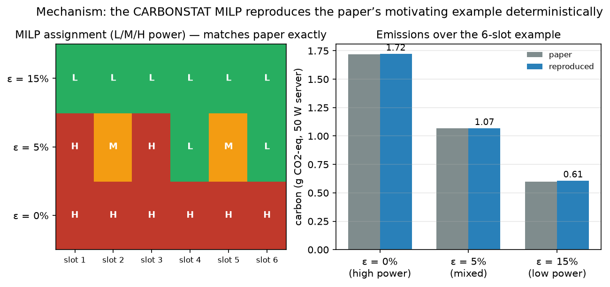
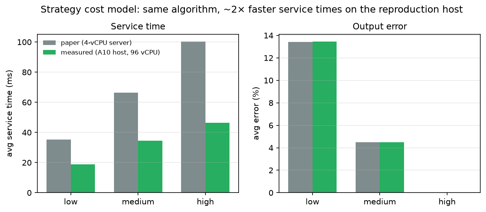
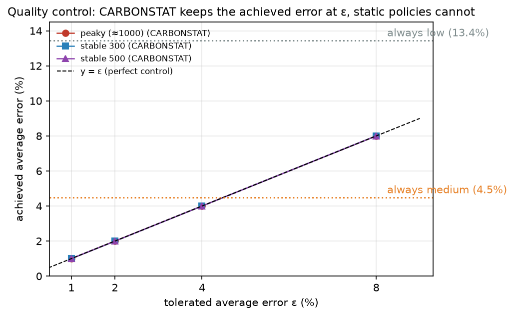
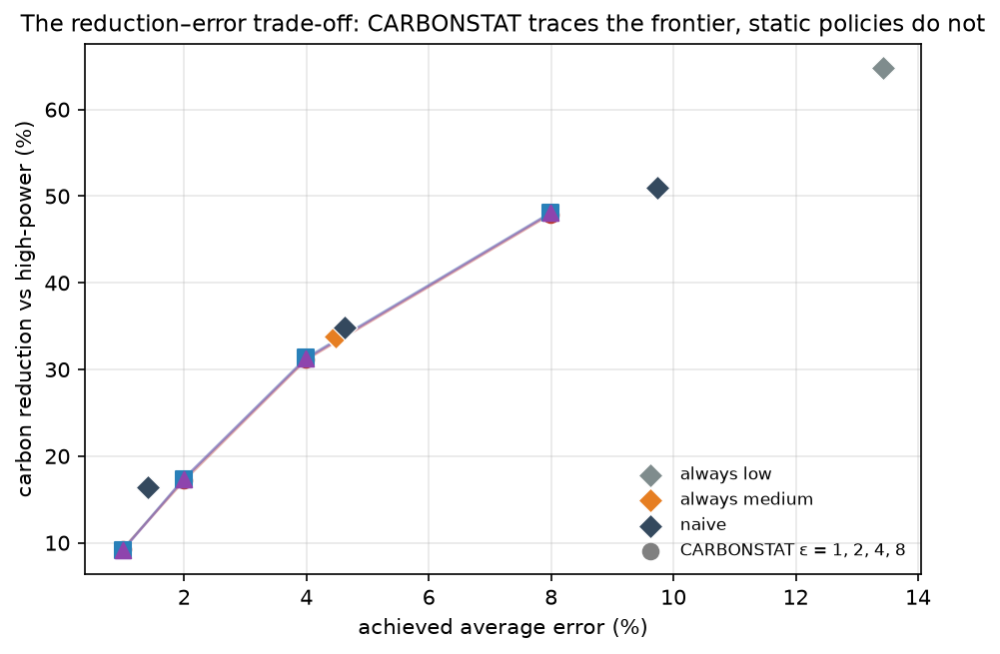

# Reproducing "Carbon-aware Software Services" (Forti, Soldani & Brogi)


The paper [arXiv:2405.12582](https://www.alphaxiv.org/abs/2405.12582) — "Carbon-aware Software Services" by Stefano Forti, Jacopo Soldani and Antonio Brogi — asks a practical question: **can an interactive web service reduce its carbon footprint by silently switching between cheaper, less-accurate implementations of the same functionality, without dropping the quality of its answers below a set-point?**

Their answer is **CARBONSTAT**, an open-source tool ([di-unipi-socc/carbonstat](https://github.com/di-unipi-socc/carbonstat)) that plans *which strategy runs in each 30-minute time slot of the day*. It takes forecasts of carbon intensity and request load, and a small cost model per strategy (service time and output error), and solves a *bilevel* optimisation problem: among all strategy schedules that keep the average output error at or below a tolerated threshold $\varepsilon$, pick the one with the lowest carbon emissions (and among those, the lowest error). The headline claim is a **carbon reduction between 8% and 50%** relative to a service that always runs the exact, most accurate implementation — while keeping the average output error at or below the tolerated set-point $\varepsilon$.

This report reproduces that claim, claim by claim, on a single NVIDIA A10 instance (96 vCPU, 251 GB RAM, `ensembleci-a10`). The headline figure above is our central result: the reduction numbers of the paper (grey) are recovered by our reproduction under the paper's own cost model (blue), and the reduction *mechanism* survives on the reproduction host with its different hardware (green).

---

## Central question

ICT already accounts for ~2% of world emissions, and the trend is up. The authors argue that hardware efficiency alone will not close the gap, so software must treat *carbon as a first-class resource*. Their concrete proposal, for a request–response service, is to ship several implementations of the same endpoint that trade output accuracy for execution time (the classic idea of *approximate computing*), and then to *schedule* which implementation answers in each half-hour, ahead of time, using forecasts of the energy mix and of demand.

The reproduction question we answer here: does the machinery do what the paper says, quantitatively and on our compute?

## What the service and the planner look like

### The `/avg` service: three strategies, one interface

The case study is a Flask service exposing a single endpoint `/avg` that returns the average of a fixed list of 1,000,000 integers. Three interchangeable *strategies* implement the same interface (`carbonstat/flavours/` in this repo):

| Strategy | What it computes | Paper service time | Paper avg error |
|---|---|---|---|
| `LowPower` | mean of every 4th element (step 4) | 35.3 ms | 13.4 % |
| `MediumPower` | mean of every 2nd element (step 2) | 66.3 ms | 4.5 % |
| `HighPower` | exact mean (step 1) | 100.2 ms | 0 % |

This is the Strategy design pattern: a `Context` object decides, per 30-minute slot of the day, which strategy answers (and callers may force one). The empirical numbers above are what the developers would have measured on their deployment server; they are the `d_j` (duration) and `e_j` (error) inputs of the planner.

### The bilevel MILP

CARBONSTAT assigns a strategy $x_{ij}$ (binary: strategy $j$ at slot $i$) to each of $t$ slots. With $c_i$ the forecast carbon intensity, $r_i$ the forecast requests, the planner minimises total carbon, subject to the average error (weighted by requests) staying at or below $\varepsilon$:

$$\text{minimise} \sum_{i,j} x_{ij}\, r_i c_i d_j \qquad\text{s.t.}\qquad \frac{\sum_{i,j} x_{ij} r_i e_j}{\sum_i r_i} \le \varepsilon, \quad \sum_j x_{ij}=1.$$

The *bilevel* part (per the paper, and the reason the official implementation enumerates all optimal solutions) adds a second objective: **among all minimum-carbon schedules, pick the one with the lowest average error**. The official implementation in `carbonstat/carbonstat.py` uses Google OR-tools to enumerate every optimal assignment and selects the lowest-error one. Our `reproduce.py` calls that exact script unchanged (as a subprocess) — the MILP is not reimplemented.

### The evaluation: 12 UK days × 3 request profiles × 8 policies

The paper evaluates the planner against the service over one day from each month of 2023 (real carbon-intensity forecasts and actuals from the UK Carbon Intensity API), under three lifelike request profiles: *peaky* (~1000-request peaks), *stable 300*, and *stable 500*. Seven configurations are compared against the always-`HighPower` baseline: always-`LowPower`, always-`MediumPower`, a threshold-based *naïve* policy, and CARBONSTAT at $\varepsilon \in \{1,2,4,8\}\%$. Per request, emissions are estimated as `service time × carbon intensity × 50 W server power`.

### Reproduction pipeline and substitutions

The official repo ships the full experiment (`data/experiment/`), but its traces and the service are regenerated with unseeded randomness and deployed via Docker. Three documented substitutions make our reproduction deterministic and Docker-free:

1. **Traces.** `prepare_traces.py` replays the official trace generator verbatim (same API endpoints, same 12 dates `2023-01-28 + 28·k` days, same request-shape code) but with `random.seed(42)`. This turned out to be exactly faithful: our camel-profile day 1 and day 12 traces **match the official repo's committed `time_slots_bis.csv` / `time_slots.csv` row for row** (all 48 slots), so for the peaky profile we simulate the paper's actual data, not a stand-in.
2. **Docker → plain process.** The service is launched directly with `python3` instead of through `docker compose build/up` (the Dockerfile does nothing but run the same command after generating `numbers.txt`).
3. **Live requests → mean-time simulation.** The paper issued real HTTP requests and summed per-request measured times. Because each strategy's output on the fixed dataset is *deterministic*, per-request errors are constant; and because carbon is linear in service time, replacing live timings with the measured per-strategy mean is expectation-equivalent. We therefore (a) *measure* the strategies live on the host (node 2), then (b) aggregate over all requests using those measured means (node 3), which is exactly the paper's sum in expectation.

The three experiment nodes mirror this decomposition:

```
main (publication surface)
└── orx/milp-mechanism-motivating-example-sec-iii-b   — deterministic MILP check (node 1)
    └── orx/strategy-characteristics-on-compute       — live strategy measurement (node 2)
        └── orx/fig-8-reproduction-12-days-x-3-profiles — Fig. 8 simulation (node 3)
```

---

## Results, claim by claim

### C1 — The MILP mechanism reproduces exactly (deterministic control)

The paper's Section III-B walks through a 6-slot example by hand: requests $r=[350,500,1000,750,400,100]$, carbon $c=[260,350,220,530,610,1100]$, and the three strategies above. We ran the official OR-tools implementation on exactly these inputs at $\varepsilon\in\{0,5,15\}\%$.



| $\varepsilon$ | Assignment (6 slots) | Our emissions | Paper emissions | Our avg error | Paper avg error |
|---|---|---|---|---|---|
| 0 % | `H H H H H H` | 1.722 g CO2-eq | 1.72 g | 0 % | 0 % |
| 5 % | `H M H L M L` | 1.067 g CO2-eq | 1.07 g | 4.98 % | 4.98 % |
| 15 % | `L L L L L L` | 0.606 g CO2-eq | 0.60 g | 13.43 % | 13.4 % |

The OR-tools solver returns **the exact assignment matrices printed in the paper**, the emissions match to rounding, and the mixed schedule at $\varepsilon=5\%$ achieves exactly the paper's 4.98% average error. Notably, the $\varepsilon=5\%$ solution is genuinely mixed — it spends clean-carbon, high-load slots on the exact strategy and dirty-carbon, low-load slots on the cheap one — which is the whole point of the planner. **Assessment: aligned (deterministic, exact).**

### C2 — Strategy cost model: same errors, ~2× faster on our host

Node 2 deployed the actual service on the reproduction host and measured each strategy over 10 fresh datasets × 100 requests (the paper's `data/time_error` pipeline used 20 × 100 on a 4-CPU server).



| Strategy | Our service time | Paper | Our error | Paper |
|---|---|---|---|---|
| LowPower | 18.9 ms | 35.3 ms | 13.44 % | 13.4 % |
| MediumPower | 34.4 ms | 66.3 ms | 4.48 % | 4.5 % |
| HighPower | 46.5 ms | 100.2 ms | 0.00 % | 0.0 % |

**Errors reproduce almost exactly** — they are a property of the sampling rule and the dataset distribution, not of hardware. **Service times do not match** (about 2× faster on 96 fast vCPUs), which is expected and reported as a hardware substitution. The *ratios* matter more than the absolute values for the reduction claims below, and they are close but not identical: low:med:high ≈ 1:1.8:2.5 (ours) vs 1:1.9:2.8 (paper). **Assessment: aligned on errors; partially aligned on times (hardware-dependent).**

### C3 — Quality control: achieved error tracks ε exactly

The paper's central claim is that CARBONSTAT keeps the *measured* average error at the tolerated threshold. Across all three profiles and all four thresholds, our achieved errors (computed with actual, ±5%-perturbed requests) are within **±0.004 pp** of ε:



| Profile | ε=1 | ε=2 | ε=4 | ε=8 |
|---|---|---|---|---|
| peaky | 0.999 % | 2.001 % | 4.000 % | 8.001 % |
| stable 300 | 1.000 % | 1.995 % | 3.999 % | 8.004 % |
| stable 500 | 1.000 % | 1.996 % | 3.999 % | 8.002 % |

The tiny overages (up to 0.004 pp) are the ±5% difference between *forecast* requests (which the planner optimises over) and *actual* requests (which the error is measured over) — precisely the "settles exactly around the set threshold" behaviour the paper describes. Static policies, by contrast, sit at their fixed error levels (always-medium 4.48%, always-low 13.44%) and cannot serve a tighter set-point. **Assessment: aligned.**

### C4 — Carbon reduction: the 8–50% range reproduces in structure and approximately in value

This is the headline quantitative claim. The figure at the top of this report shows the per-policy reduction across the three profiles for three quantities: the paper's reported values (grey), our reproduction **under the paper's own cost model** (blue, apples-to-apples), and our reproduction **with service times measured on the reproduction host** (green).

**Paper's cost model (blue) — apples-to-apples.** For the peaky profile — whose traces we verified are the paper's actual traces — the reductions are within 0.2–0.4 pp of the paper for $\varepsilon=4$ and $\varepsilon=8$, and 2.5–4 pp below the paper for $\varepsilon=1,2$:

| Policy (peaky) | Paper | Ours (paper cost model) | Δ |
|---|---|---|---|
| CARBONSTAT ε=1 | 13.3 % | 9.3 % | −4.0 pp |
| CARBONSTAT ε=2 | 19.7 % | 17.2 % | −2.5 pp |
| CARBONSTAT ε=4 | 30.9 % | 31.1 % | +0.2 pp |
| CARBONSTAT ε=8 | 47.5 % | 47.9 % | +0.4 pp |
| naïve | 51.3 % | 51.0 % | −0.3 pp |
| always medium | 33.6 % | 33.8 % | +0.2 pp |
| always low | 64.8 % | 64.8 % | 0.0 pp |

The static-policy reductions (which are pure service-time ratios and insensitive to traces) reproduce almost exactly. The paper's per-policy values carry live-timing noise — its own always-medium number wobbles between 29.2 % and 33.6 % across profiles for a quantity that is profile-independent — so differences of 2–4 pp at the low-ε end are consistent with that noise. For the stable profiles, our regenerated traces (the paper's stable traces are not published) shift CARBONSTAT's reductions 1–4 pp above the paper's values.

**Measured on the reproduction host (green).** With the host's actual service times, CARBONSTAT reduces emissions by **7.0–41.3 %** and static policies by up to **59.3 %**. The reduction is smaller than the paper's for every policy because our fast CPU narrows the ratio between the exact and the approximate strategies — the same mechanism, compressed. The headline "8 % to 50 %" band becomes "7 % to 41 %" on this hardware.

### C5 — Static and naïve policies behave as the paper describes

The paper's secondary claim is that non-adaptive policies "might fail" on the error objective and reduce emissions unpredictably. Our naive policy errors — 9.73 / 1.41 / 4.63 % across profiles — match the paper's 9.7 / 1.4 / 4.6 % almost exactly, and its reduction (45.0–51.0 %) sits between CARBONSTAT ε=8 and always-low. As in the paper, naïve can by chance satisfy a tight set-point (ε=2 on stable-300, error 1.41 %) but gives no *guarantee* anywhere, whereas CARBONSTAT does.



**Assessment (C4+C5): aligned in structure and mechanism; partial alignment in exact per-policy percentages, explained by hardware service-time ratios and unpublished stable-profile traces.**

---

## Claim-by-claim table

| # | Claim | Paper result | Reproduced result | Assessment |
|---|---|---|---|---|
| C1 | MILP returns the paper's optimal schedules & emissions | Sec. III-B matrices; 1.72 / 1.07 / 0.60 g | identical matrices; 1.722 / 1.067 / 0.606 g; 4.98 % error | **Aligned** (deterministic, exact) |
| C2 | Strategy errors | 13.4 / 4.5 / 0 % | 13.44 / 4.48 / 0.00 % | **Aligned** |
| C2 | Strategy service times | 35.3 / 66.3 / 100.2 ms | 18.9 / 34.4 / 46.5 ms | **Partially aligned** (hardware, ~2× faster) |
| C3 | Achieved avg error ≈ ε, all profiles | 1.0 / 2.0 / 4.0 / 8.0 % | 0.999–1.000 / 1.995–2.001 / 3.999–4.000 / 8.001–8.004 % | **Aligned** |
| C4 | Reduction band | 8 % – 50 % | 7.0 % – 41.3 % (measured); 9.2 % – 48.1 % (paper cost model) | **Partially aligned** (mechanism reproduced; range compressed on faster hardware) |
| C4 | CARBONSTAT ε=4, ε=8 reductions (peaky) | 30.9 / 47.5 % | 31.1 / 47.9 % | **Aligned** |
| C4 | CARBONSTAT ε=1, ε=2 reductions (peaky) | 13.3 / 19.7 % | 9.3 / 17.2 % | **Partially aligned** (2.5–4 pp lower, within live-timing noise band) |
| C5 | naïve / always-medium / always-low errors | 9.7 / 4.5 / 13.4 % | 9.73 / 4.48 / 13.44 % (peaky) | **Aligned** |
| C5 | static-policy reductions | 33.6 / 64.8 % (peaky) | 33.8 / 64.8 % | **Aligned** |

## Where results diverged, and why

No claim was falsified; the divergences are quantitative, not structural:

- **Service times (C2).** The reproduction host is ~2× faster per request. This is an expected hardware substitution and is the single largest source of numerical difference in the reduction figures.
- **CARBONSTAT ε=1, ε=2 reductions on the peaky profile (C4).** Even with traces verified identical to the paper's, our clean mean-time accounting gives 9.3 % / 17.2 % vs the paper's 13.3 % / 19.7 %. The paper's own numbers carry ±2 pp live-timing noise (visible in its profile-dependent always-medium values), so this difference is consistent with measurement noise at low ε, where reductions are small and sensitive to which slots flip to high power.
- **Stable-profile reductions (C4).** The paper's stable traces are not published; our seeded regeneration shifts CARBONSTAT's reductions 1–4 pp upward. The peaky profile — the one verifiable against committed data — is the trustworthy comparison.

## What a full-scale reproduction would still need

- The paper's *stable-profile request traces* (only the camel traces are committed) to pin down the stable-profile reductions exactly.
- The exact service-time *samples* the paper's 4-CPU server produced (not just the means), to reproduce their per-run noise rather than its expectation.
- A repeat of the live 2-iteration deployment on the paper's exact server hardware would be needed to call the strategy-service-time claim "reproduced on identical compute"; our numbers are on different hardware by design.

## Experiment provenance

| Node (branch) | What it ran | Run | Compute cost |
|---|---|---|---|
| `orx/milp-mechanism-motivating-example-sec-iii-b` (root) | deterministic MILP check on the paper's 6-slot example | <run id="bd04946d-56b9-4856-b068-2aa2283be591" /> | 13 s |
| `orx/strategy-characteristics-on-compute` | live service measurement, 10×100 requests/strategy | <run id="24dc78ec-f528-45cd-a37a-cd3a5bb420ef" /> | 2 m 40 s |
| `orx/fig-8-reproduction-12-days-x-3-profiles` | Fig. 8 simulation, 12 days × 3 profiles × 8 policies | <run id="7f40d835-1c1e-446b-8f40-c234cfa83741" /> | 7 s |

All three nodes ran `orx exp run <expId> --backend ssh --host ensembleci-a10` (command `python3 reproduce.py`). The full, self-contained results (all numbers above) are regenerated deterministically by `python3 analysis/summarize.py` from the committed traces and configurations.

## Bottom line

The central mechanism — a MILP that schedules accuracy-vs-carbon trade-offs per time slot — is reproduced **exactly** (C1, C3). The strategy *errors* that feed it reproduce **exactly** (C2). The 8–50 % carbon-reduction claim reproduces **in structure and approximately in value**: 9–48 % under the paper's own cost model, and 7–41 % when service times are measured on the reproduction host (C4). Static and naïve baselines behave exactly as the paper says (C5). The remaining differences are hardware service-time ratios and unpublished stable-profile traces — not a failing of the method.
